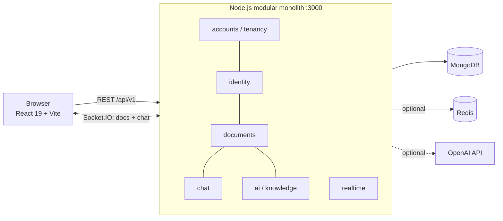

# CollabDocs — a decision & knowledge workspace

**The problem:** the work lives in documents, the reasoning lives in chat, and nothing links them. Six weeks later nobody can answer *"why is it this way, and who decided?"*

CollabDocs answers that question. Every document carries its own conversation. Discussions anchor to the exact passage they're about. Decisions are promoted from chat into a per-document decision log — as a database relation, not a pasted link. An AI layer turns documents *plus* their conversations into durable, cited knowledge: summaries, navigable mind maps, extracted action items, and grounded Q&A that can always point at its sources.

> Google Docs owns authoring. Slack owns talking. Neither owns the knowledge that results.

---

## Feature tour

| Area | What's built |
|---|---|
| **Documents** | Google-Docs-style paged editor, realtime co-editing presence, sharing with owner/editor/viewer roles, autosave |
| **The context bridge** | Select any passage → "Discuss" opens a conversation with the quote attached · anchored threads jump back to their passage · chat messages promote into a document **decision log** |
| **Chat** | Persistent global & per-document conversations, replies, reactions, mentions, read receipts, typing/presence, message editing |
| **AI knowledge engine** | Summaries, mind maps (interactive canvas with drag/zoom/persisted layout), action-item extraction, workspace-wide Q&A with citations, knowledge graph across documents |
| **Action items** | `{task, owner, due}` extracted from documents become assignable, status-tracked work, surfaced on the dashboard |
| **Multi-tenancy** | Shared-schema, row-level isolation: every record carries its organization; retrieval can never cross tenants |
| **Plans & seats** | Free (3 seats) / Pro (10) / Team (20) with server-enforced entitlements; team members inherit the org's plan |

## Architecture decisions worth reading

**1. AI that degrades honestly instead of breaking.**
The knowledge engine has two paths behind one interface: a deterministic local engine (extractive summarization, heading/theme-based mind maps, lexical retrieval) that needs **no API key and no per-request cost**, and a provider path (OpenAI) used when configured *and* entitled. Free users get real, truthful output — every sentence traceable to the document. Paid plans add reasoning. The capability never disappears.

**2. Evidence-bound artifacts.**
AI artifacts are cached by **document checksum + model**. Mind-map nodes carry `sourceChunks`; answers carry citations. Every generated statement can be traced to the exact revision that produced it — provenance is a data-model property, not a UI label.

**3. Permission-aware retrieval as a primitive.**
Search, Q&A, and the knowledge graph all resolve through a single access-policy module (`documents/service.js`). Access filtering happens **before** retrieval, never after generation — the AI cannot surface a document you can't read.

**4. Tenancy by construction, not discipline.**
`accountId` scoping lives in exactly one choke point that every reader inherits. The tenant branch can only *widen* access to workspace-visible documents of the caller's own org — a call site that forgets the parameter degrades to stricter ACL-only behavior instead of leaking. Backfill migration included (`npm run migrate:tenancy`).

**5. A deliberate modular monolith.**
This began as eight microservices behind a gateway. It was consciously consolidated into one Node process with module boundaries (identity, documents, chat, AI, accounts) enforced through cross-module service interfaces. One database, one policy layer, transactional consistency between a decision and its document — which is precisely what a trustworthy decision log requires.



## Repository layout

```text
collab-doc/
├── frontend/                 React 19 + Vite SPA (Tailwind, shadcn/ui, Redux Toolkit)
│   └── DESIGN_SYSTEM.md      The product design language & component recipes
├── backend/
│   ├── src/modules/          identity · documents · chat · ai · accounts
│   ├── src/platform/         config, MongoDB lifecycle
│   ├── src/realtime/         unified Socket.IO (collaboration + chat)
│   ├── packages/shared/      auth middleware, errors, logging
│   ├── scripts/              syntax check, tenancy backfill migration
│   ├── tests/                37 node:test suites (policy, tenancy, entitlements, RAG, HTTP)
│   └── docker/               local compose: MongoDB, Redis, backend, frontend
└── system-workflow.md        Full REST + Socket.IO contract reference
```

## Running locally

Prerequisites: Node 20+, Docker Desktop.

```bash
# infrastructure
docker compose -f backend/docker/docker-compose.yml up -d mongodb redis

# backend
cd backend
cp .env.example .env.local        # fill in MONGO_URI and a JWT secret
npm install && npm run dev        # http://localhost:3000

# frontend (new terminal)
cd frontend
cp .env.example .env.local
npm install && npm run dev        # http://localhost:5173
```

Optional environment:

| Variable | Effect |
|---|---|
| `OPENAI_API_KEY` / `OPENAI_MODEL` | Enables provider AI (grounded Q&A, synthesized artifacts, semantic search). The app runs fully without it. |
| `SUPER_ADMIN_EMAILS` | Comma-separated platform admins — full AI access + the plan-management console |

### Verify

```bash
cd backend  && npm run check && npm test   # 37/37
cd frontend && npm run lint  && npm run build
```

## Honest limitations (known, by design of scope)

- Realtime sync relays whole-document HTML (last-write) — a structured editor + CRDT is the planned replacement
- Stored document HTML is not yet sanitized server-side; JWTs live in localStorage — hardening is scheduled before real-user deployments
- Email delivery, OAuth/SSO, and payment processing are intentionally stubbed (plans are granted by the platform admin)

These are tracked deliberately: the project optimizes for demonstrating the *decision-context* thesis end-to-end rather than re-building commodity infrastructure first.

---

Built by **Saksham Kanojia** — full-stack: React 19, Node/Express, MongoDB, Socket.IO, Redux Toolkit, Tailwind, OpenAI integration, Docker, GitHub Actions CI.
